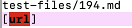
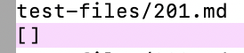
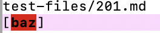

# Lab Report 5

## Part 1: How you found the tests with different results?

I used vimdiff on the results of running a bash for loop.

## Part 2: Link to two of the test-files with different-results
1. [File 194](https://github.com/nidhidhamnani/markdown-parser/edit/main/test-files/194.md)
2. [File 201](https://github.com/nidhidhamnani/markdown-parser/edit/main/test-files/201.md)

## Part 3: For Each Test

### a. Describe which implementation is correct, or neither if both give the wrong output
1. For file 194, the provided output is correct;
2. For file 201, our implementation is correct.

### b. Indicate both actual outputs (provide screenshots) and also what the expected output is (list the links that are expected in the output).

- Actual output for our implementation (File 194)

- Actual output for the provided implementation (File 194)

- Expected output for file 194 should be `url`
- Actual output for our implementation (File 201)

- Actual output for the provided implementation (File 201)

- Expected output for file 194 should be empty.

### c For the implementation that’s not correct, describe the bug (the problem in the code) in about 2-3 sentences. 

- (File 194) 

### d Provide a screenshot of code and highlight where the change needs to be made.

